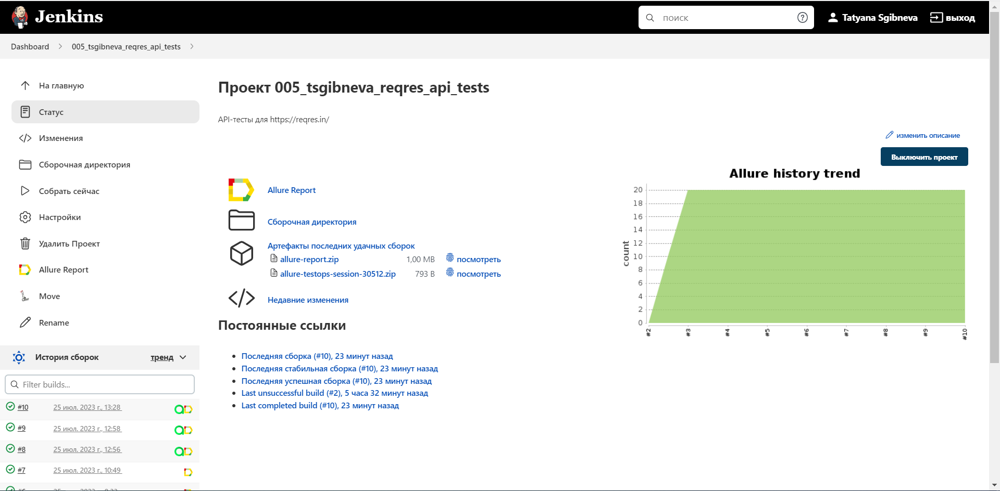
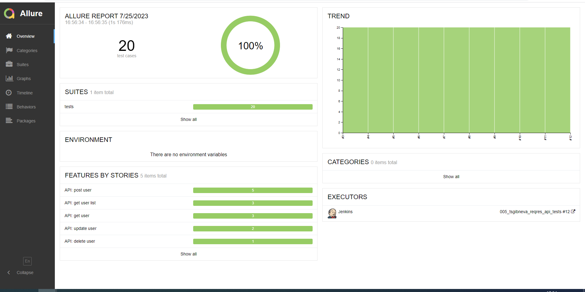
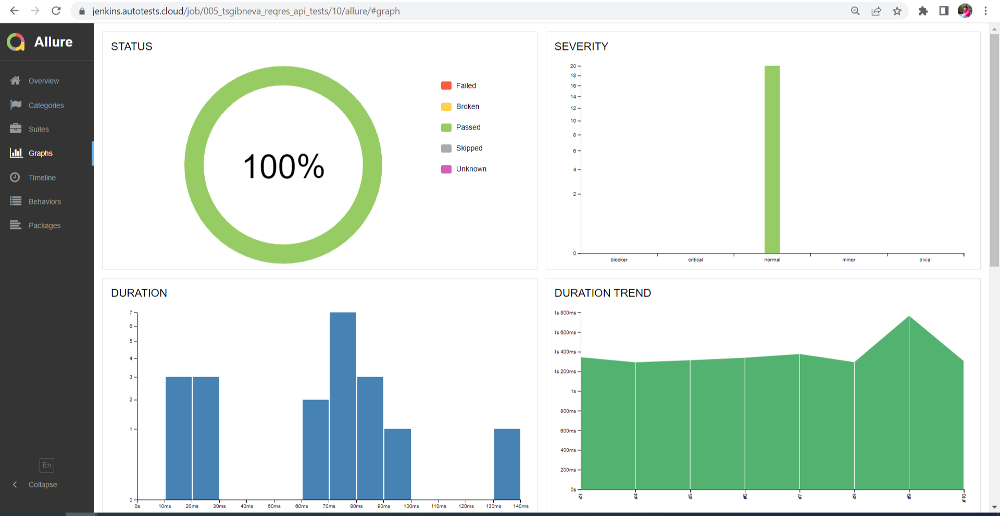
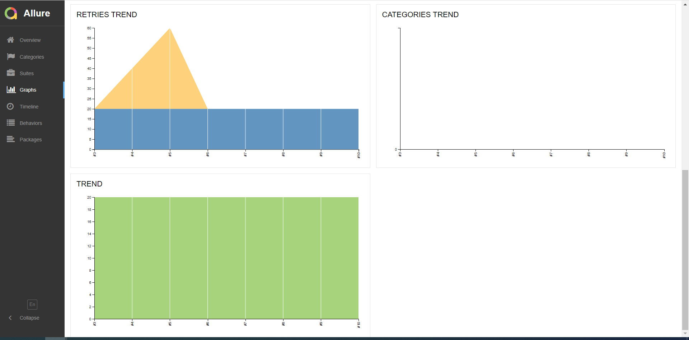
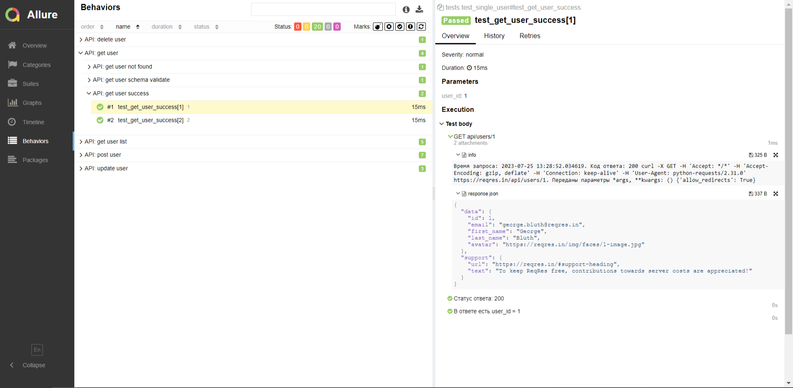
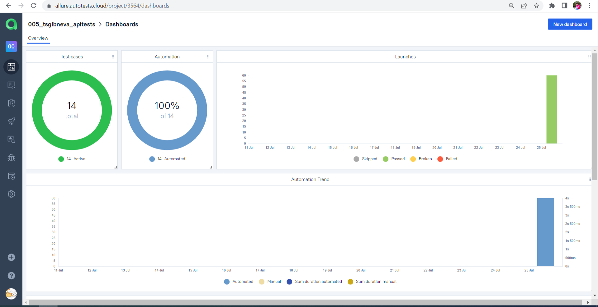
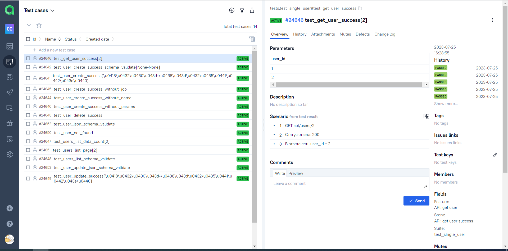
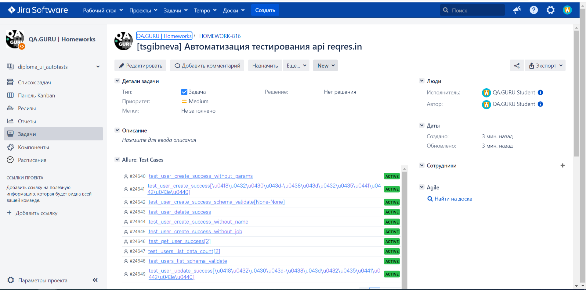
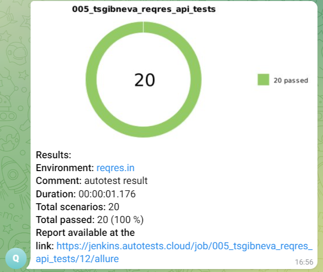

# API-автотесты для reqres.in/
Учебный проект: API-тесты для песочницы https://reqres.in/

<!-- Технологии -->
## Использованы технологии:
<p  align="left">
  <code></code>
  <code></code>
  <code></code>
  <code></code>
  <code></code>
  <code></code>
  <code></code>
  <code></code>
  <code></code>
</p>

<!-- Тест кейсы -->

## Автоматизировано тестирование API:
* get - single user
* get - list users
* post - create user
* put - update user
* delete - delete user

  Для всех API тестируется бизнес-логика, проверяются коды ответов и валидируется схема ответа.

## Запуск тестов в Jenkins
<p  align="left">
  <code></code>
</p>

### [Jenkins](https://jenkins.autotests.cloud/job/005_tsgibneva_reqres_api_tests/)

#### Запуск тестов:
```bash
python -m venv .venv
source .venv/bin/activate
pip install -r requirements.txt
pytest .
```
  
##### При нажатии на "Собрать сейчас" тесты собираются из GitHub и начинается прохождение тестов.
<p  align="left">
  <code></code>
</p>

## В результате генерируется allure-отчет
<p  align="left">
  <code></code>
</p>

### [Allure-report](https://jenkins.autotests.cloud/job/005_tsgibneva_reqres_api_tests/12/allure/)

##### Сводная информация по прогону тестов
<p  align="left">
  <code></code>
</p>

##### Инфографика
<p  align="left">
  <code></code>
  <code></code>
</p>

##### Во вкладке Behavoirs тесты сгруппированы с точки зрения бизнес-логики, а attachments есть полная информация об отправленном запросе (время, curl, код ответа, дополнительные параметры) и ответ.
<p  align="left">
  <code></code>
</p>

## Настроена интеграция с Allure TestOps 
<p  align="left">
  <code></code>
  <code></code>
</p>

### [Allure TestOps](https://allure.autotests.cloud/project/3564/dashboards)
<p  align="left">
  <code></code>
  <code></code>
</p>

### [Тикет в Jira](https://jira.autotests.cloud/browse/HOMEWORK-816)
<p  align="left">
  <code></code>
</p>


## По результату прогона отправляется уведомление в телеграм
<p  align="left">
  <code></code>
</p>

<p  align="left">
  <code></code>
</p>
